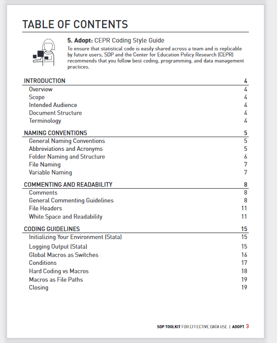
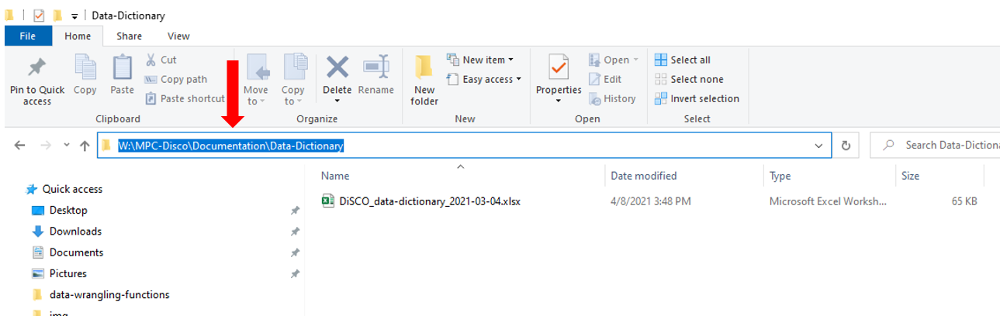
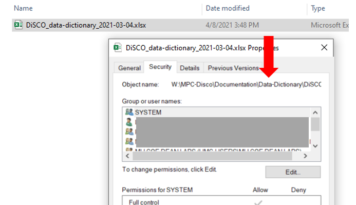
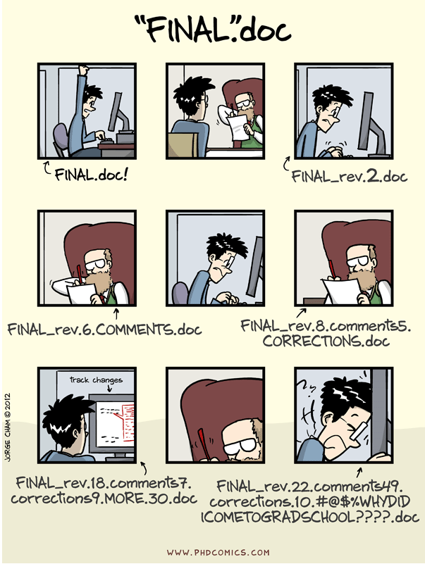
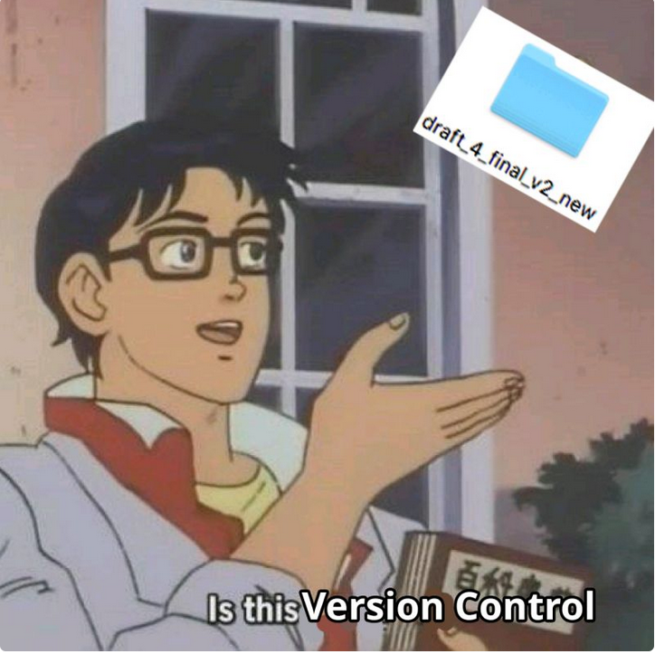
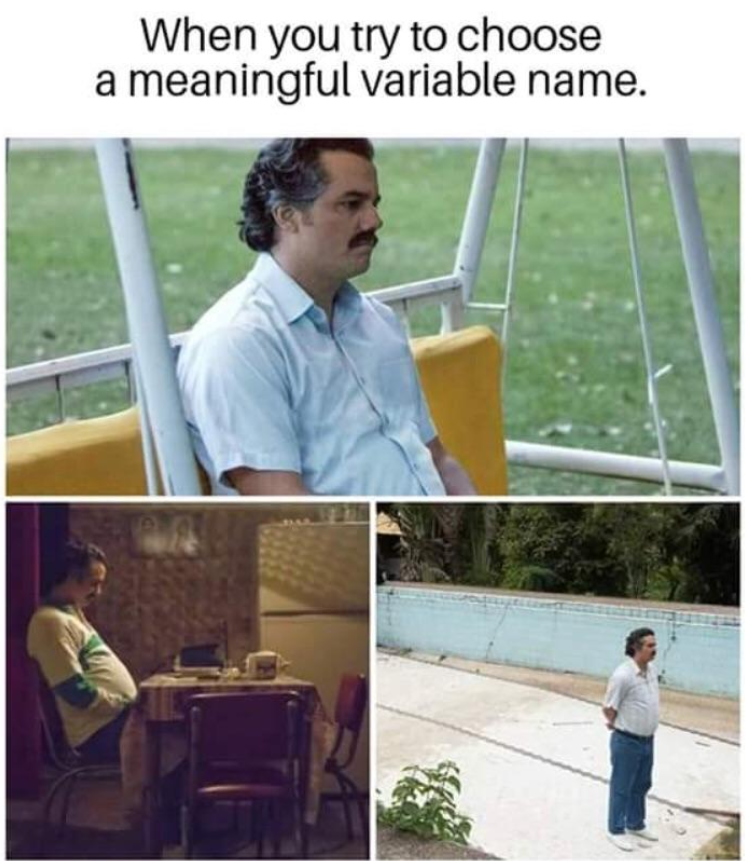
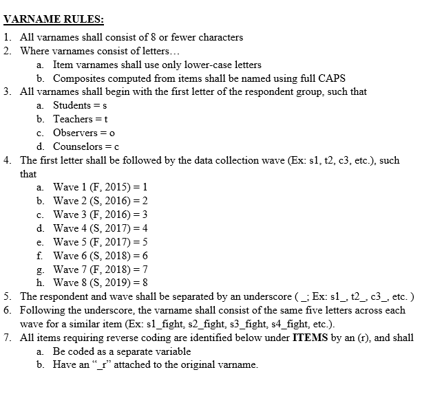
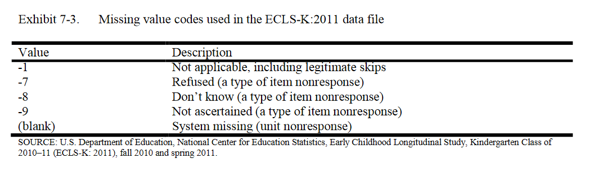

```{r setup, include=FALSE}
options(htmltools.dir.version = FALSE)

library(tidyverse)
library(kableExtra)
library(flair)
```

# Scenario

## You need to access the data dictionary for Project A, so you start to look around in the Project A directory

<br>

```{r fig.align="center", echo=FALSE, out.width='60%'}

```

---

class: inverse

# Project A directory

**What folder do you look in?** **What questions do you have?**

* `r emo::ji("folder")` project-a
  * `r emo::ji("folder")` Mary's Dissertation
  * `r emo::ji("folder")` Entry Files
  * `r emo::ji("folder")` From Data Computer
  * `r emo::ji("folder")` IOA re-entry for Volunteers
  * `r emo::ji("folder")` project-a
  * `r emo::ji("folder")` project-a data2
  * `r emo::ji("folder")` video coding
  * `r emo::ji("folder")` Catherine
  * `r emo::ji("folder")` propensity scoring
  * `r emo::ji("folder")` Frank's dissertation
  * `r emo::ji("page facing up")` Measures Documentation.docx
  * `r emo::ji("page facing up")` Measures for papers_in progress by Terrance.docx
  * `r emo::ji("page facing up")` Timeline for projects.xlsx


---

class: inverse

# Project A directory - cont.

**You make your way into the *project-a data2* folder and you find a *data documentation* folder**

**What file do you choose?**


* `r emo::ji("folder")` data documentation
  * `r emo::ji("page facing up")` data dictionary_backup.xlsx
  * `r emo::ji("page facing up")` data dictionary_backup backup.xlsx
  * `r emo::ji("page facing up")` data dictionary_FINAL.xlsx
  * `r emo::ji("page facing up")` data dictionary_11.05.2020.xlsx
  * `r emo::ji("page facing up")` data dictionary_11.05.2020_AS edits.xlsx
  * `r emo::ji("page facing up")` data dictionary 11.06.2020_AS edits FINAL.xlsx
  * `r emo::ji("page facing up")` data dictionary 11.07.2020_AS JT edits_FINAL.xlsx

---

# You open the data dictionary

**Are these variable names clear without the dictionary?**

**Are the value codes clear without the dictionary?**

<br>

```{r echo=FALSE, out.width='10%', out.height= '50%'}

tibble::tribble (~ var_name, ~ question, ~value,
                 "Q1", "What is your gender", "0=female, 1=male, 2=non-binary",
                 "Q2", "What is your age?", "numeric",
                 "Q3", "What grade are you in?", "1,2,3,4,5",
                 "Q4_1", "I pay attention in class", "1=SD, 2=D, 15=A, 16=SA",
                 "Q4_2", "I try hard to do well in this class", "1=SD, 2=D, 15=A, 16=SA") %>%
gt::gt()
  
```

---

# Style guide

## A set of standards around data management

--

* Improves searchability

--

* Improves interpretation

--

* Allows reproducibility

--

* Creates consistency across all projects and/or within individual projects

--

* Document this style guide keep it somewhere that is easily accessed by ALL team members (Team Wiki, in a ReadME at the top of a project file folder)

--

* Create this guide before a project begins

--

* Train your team to follow the style guide protocol

---

# Style guide topics for today


.pull-left[

<br>

Protocols for:

  * Directory Structure


  * File Naming


  * Variable Naming


  * Value Coding
]

.pull-right[

```{r fig.align="center", echo=FALSE}

```
Source: [Harvard SDP](https://hwpi.harvard.edu/files/sdp/files/sdp-toolkit-coding-style-guide.pdf)

]

---

class:middle, inverse

# DIRECTORY STRUCTURE

---

class: inverse

# Directory structure - file tree

* `r emo::ji("folder")` project-new
  * `r emo::ji("folder")` documentation
      * `r emo::ji("page facing up")` project-new_data-dictionary_v05.xlsx
      * `r emo::ji("page facing up")` project-new_codebook_v02.pdf
  * `r emo::ji("folder")` data
      * `r emo::ji("folder")` cohort-1
          * `r emo::ji("folder")` raw
              * `r emo::ji("page facing up")` c1_stu_svy_download_2020-11-05.csv
          * `r emo::ji("folder")` syntax
              * `r emo::ji("page facing up")` c1_stu_svy_cleaning-script_v01.R
          * `r emo::ji("folder")` clean
              * `r emo::ji("page facing up")` c1_stu_svy_clean_v01.csv
  * `r emo::ji("folder")` tracking
      * `r emo::ji("folder")` cohort-1
          * `r emo::ji("folder")` participant-database
              * `r emo::ji("page facing up")` c1_particpant-db_v01.sqlite


---

class: inverse

# Directory Structure - file paths

### Every document has a file path

* `r emo::ji("folder")` project-new
  + `r emo::ji("folder")` documentation
      + `r emo::ji("page facing up")` project-new_data-dictionary_v05.xlsx
      + `r emo::ji("page facing up")` project-new_codebook_v02.pdf


--

In Windows:

* project-new\documentation\project-new_data-dictionary_v05.xlsx
* project-new\documentation\project-new_codebook_v02.pdf

--

On Mac:

* project-new/documentation/project-new_data-dictionary_v05.xlsx
* project-new/documentation/project-new_codebook_v02.pdf

---

# Your file paths live within a home directory

* For the MPSI, that home folder is W: (our shared network drive)
  * **Windows**: W:\MPC-All-Projects
  * **Mac**: /Volumes/MPC-All-Projects
  
* If you are storing files on your computer, your home folder is most likely your username. 
  * **Windows**: C:\Users\username
  * **Mac**: Users/username
  
So the full file path for our previously mentioned data dictionary may be:
  * W:\MPC-All-Projects\project-new\documentation\project-new_data-dictionary_v05.xlsx  
  
  OR  
  
  * /Volumes/MPC-All-Projects/project-new\documentation\project-new_data-dictionary_v05.xlsx

---

# To find your full file paths

On Windows you can simply click into the *address bar* to see your path

```{r fig.align="center", echo=FALSE, out.width='80%', out.height= '20%'}

```

Or right click on a document and go to *properties* and then *security*

```{r fig.align="center", echo=FALSE,out.width='45%', out.height= '30%'}

```

---

# Directory structure style guide

--

* Allow you to find files easier
  + Which path is more descriptive?
      - **SG**: W:\project-a\data\cohort-1\student\raw
      - **No SG**: W:\Project-a\data2 New

--

* Allow your computer to find files easier
  + Which path is more machine readable?
      - **SG**: W:\project-a\data\cohort-1\student\raw
      - **No SG**: W:\Project A\Data\Cohort 1\student.raw\Survey

--

* Maintain reproducibility in your data management tasks (consistent file paths)
  + Which file paths maintain reproducibility across time?
      - **SG**: W:\project-a\data\cohort-1\student\raw **and** W:\project-a\data\cohort-2\student\raw
      - **No SG**: W:\project-a\data\cohort-1\student\raw **and** W:\project-a\data\cohort-2\raw\student

--

* Data security (limiting carte blanche access)
  + Which path is easier to maintain security?
      - **SG**: W:\project-a\data
      - **No SG**: W:\project-a


---

# Directory structure - general rules

--

* Strike a balance between deep and shallow

  + Too shallow leads to many files in one folder
  + Too deep leads to too many clicks and file paths that are too long
  
--

* Create folders that are specific enough to limit access

--

* Folder names should human readable (meaningful and easy to understand)

--

* Folder names should be machine readable

  + No spaces or punctuation
  + `_` or `-` to separate within and between pieces of metadata
  
--

* Be consistent with capitalization

--

* Consider the use of an *archive* folder for old versions of files

---

# Example directory structure style guide

1. All project directories follow this hierarchical metadata structure  
      - Level 1: Name of project  
      - Level 2: Life cycle folders  
      - Level 3: Time period/Data collection wave folders (if relevant)  
      - Level 4: Specific content folder  
      - Level 5: Participant specific folder
      - Level 5: Archive folders  
2. All folders should be named according to these rules  
      - Meaningful name but no longer than 20 characters  
      - No spaces or periods in folder names  
      - Only use lower case letters  
      - Use `-` to separate words  
3. All previous versions of files must be placed into their respective *archive* folder
      - README_versioning.txt placed in each folder to document changes between versions

<br>
<br>

Note: If versioning software is used, #3 is unnecessary
      
---

class: inverse

# Example using that style guide

* `r emo::ji("folder")` project-new
  * `r emo::ji("folder")` data
      * `r emo::ji("folder")` cohort-1
          * `r emo::ji("folder")` student
              * `r emo::ji("folder")` raw
                  * `r emo::ji("page facing up")` README_versioning.txt
                  * `r emo::ji("folder")` archive
              * `r emo::ji("folder")` syntax
                  * `r emo::ji("page facing up")` README_versioning.txt
                  * `r emo::ji("folder")` archive
              * `r emo::ji("folder")` clean
                  * `r emo::ji("page facing up")` README_versioning.txt
                  * `r emo::ji("folder")` archive
  * `r emo::ji("folder")` tracking
      * `r emo::ji("folder")` cohort-1
          * `r emo::ji("folder")` participant-database
              * `r emo::ji("page facing up")` README_versioning.txt
              * `r emo::ji("folder")` archive


---

class: middle, inverse

# FILE NAMES


---

class: center

# We are all subject to "mood based naming"

  
Source: [PhD Comics](http://phdcomics.com/comics/archive.php?comicid=1531)

---

# File naming style guide

--

* Allow you to locate files easier and prevent errors
  + Which file names are more human readable and ensure you select the most recent document?
      - **SG**: dsc_stu_svy-proto_2020-10-01.docx **and** dsc_stu_svy-proto_2020-10-22.docx
      - **No SG**: survey protocol(1) FINAL.docx **and** survey protocol(1) CE edits.docx

--

* Allow your computer to find files easier
  + Which path is more machine readable?
      - **SG**: dsc_stu_svy-protocol_2020-10-01.docx
      - **No SG**: Student survey protocol(1).docx

--

* Maintain reproducibility in your data management tasks (consistent file names)
  + Which file names maintain reproducibility across time?
      - **SG**: tch_form_cohort1_time1.xlsx **and** tch_form_cohort1_time2.xlsx
      - **No SG**: tch_form_cohort1_time1.xlsx **and** cohort1_time2_tch_form.xlsx
      - **No SG**: tch\_form\_cohort1\_time1.xlsx **and** tch\_form\_cohort1\_ time2.xlsx
      - **No SG**: tch\_form\_cohort1\_time1.xlsx **and** tch\_form\_cohort1\_Time2.xlsx


---

# File names - general rules

--

* Don't use spaces between words

  + They can often break a URL when shared
  
--

* Don't use special characters **except** `-` and `_`
 
  + No `.` `!` `\` `/` `"` `|` `*` `#` `:` `>` `<` `?` `^`
  + They can have meaning within programming languages
  
--
  
* Do use `_` to separate between metadata (ex:student_survey)

--

* Do use `-` to separate between words in the same metadata (ex: cohort-1)

--

* Be intentional with capitalization 

  + Use all lower case, or use capital letters at the start of all new words
  

---

# File names - general rules - cont.

--

* Make names descriptive

  + A user should understand the contents without opening the file

--

* Pay attention to the number of characters to prevent hitting your path limit

  + This is a file name created by Qualtrics for one of our surveys `r emo::ji("shocked")`: `Rural+Center+Montana+Study+(EIS+first)+2020-+Exemplar+Schools_March+19,+2021_07.49.sav`

--

* Consider keeping redundant metadata in the file name (ex: project name, wave)
  
  + Reduces confusion if you ever move the file
  + Helps make your files searchable
  
--

* Don't use `\` or `.` in dates. Format dates in one of two sortable ways:
  
  + [ISO-8601](https://en.wikipedia.org/wiki/ISO_8601) or [RFC-3339](https://medium.com/easyread/understanding-about-rfc-3339-for-datetime-formatting-in-software-engineering-940aa5d5f68a) format: YYYY-MM-DD
  + YYYYMMDD (this way reduces the number of characters but may be more difficult to read)

---

# File names - general rules - cont.

--

* When adding versions, pick a format and stick to it. Consider left padding with 0.
  
  + v01, v02
  
--
  
* If your files need to be run in sequential order, add the order number to the beginning of the file, again with leading zeros.

  + 01\_ , 02\_, 03\_

--

* Choose abbreviations to use for common names (ex: stu = student)

--

* Pick an order for metadata

  1. Project Name
  2. Cohort
  3. Participant
  4. Measure
  5. Version
  
```{r filenames, include=FALSE, results='hide'}
"dsc`_`c1`_`stu`_`svy-protocol`_`2021-01-07.xlsx"
```

```{r, results='asis', echo=FALSE}

decorate("filenames") %>% 
flair("dsc") %>%
flair("c1") %>%
flair("stu") %>%
flair("svy-protocol") %>%
flair("2021-01-07") %>%
knit_print.with_flair()

```

---

# Example file naming style guide

1. Never use spaces or special characters between words.
1. Use `_` between metadata and `-` to separate words within metadata
1. Use the following metadata file naming order:
    - Order of use (if relevant--and always add a 0 before single digits)
    - Cohort/Wave (if relevant)
    - Participant
    - Measure
    - Further description
    - Date (always add)--Note some schools of thought are to add this as #1 for sortability
    - Version (if necessary--add version with v# and a leading 0)
1. Format dates as YYYY-MM-DD
1. Only use lower case letters
1. Use the following abbreviations
    - student = stu
    - teacher = tch
    - survey = svy
    - protocol = proto
    - cohort = c
    - time = t

---

# Example file names using that guide

* `01_c1_t1_stu_svy_cleaning-syntax_2021-01-22.R`
* `01_c1_t1_stu_svy_cleaning-syntax_2021-01-11v02.R`
* `02_c1_t1_stu_svy_report-syntax_2021-01-23.R`
* `02_c1_t1_stu_svy_report-syntax_2021-02-05.R`

<br>

* `c1_t1_stu_svy_raw-download_2021-01-07.xlsx`
* `c1_t1_stu_svy_clean-data_2021-01-10.sav`

<br>

* `stu_svy_proto_2021-02-08.docx`
* `stu_svy_proto_2021-02-10.docx`

<br>

**Notice how easy these are to read** `r emo::ji("smiling face with heart-eyes")` 

---

class: center

# Let's talk versioning

  
Source: [devRant](https://devrant.com/search?term=version+control)


---

# Versioning

**Some sort of versioning of files is always necessary!**

You have one of two options:

1. **<span style="color: #009400; ">Use versioning software/platform (Git, SharePoint, Box, OneDrive)</span>** 

  + No need to add version or date to your file name (or to your style guide)
  + Every time you save a new copy you can add comments to explain the differences between versions
  + You can go back into your history and restore previous versions
  
2. **<span style="color: #009400; ">Create your own manual versioning (less preferred method))</span>** 

  + Again, by adding a date and/or a version number to your documents you can track the most recent versions of documents
  + Adding a README to your folders (ex: ReadME_versioning.txt) where you add comments explaining the document updates each time you save a new version

---

class:middle, inverse

# VARIABLE NAMES

---

# Variable name style guide

--

* Improves interpretation and reduces human error
  + Which variable name is more human readable?
      - **SG**: *s_gender*
      - **No SG**: *q5*

--

* Allow your computer to manipulate variables easier
  + Which variable is more machine readable?
      - **SG**: *toca33*
      - **No SG**: *Family_problems_negatively_affect_this_childs_behavior_in_school*

--

* Maintain reproducibility in your data management tasks (consistent variable names)
  + Which variable names maintain reproducibility across time?
      - **SG**: <span style="color: #009400; ">Time 1</span>: *toca1* **and** <span style="color: #009400; ">Time 2</span>: *toca1*
      - **No SG**: <span style="color: #009400; ">Time 1</span>: *toca1* **and** <span style="color: #009400; ">Time 2</span>: *toca_1*

--

* Improves data management across projects 
  + Which variable names allow you to combine data across projects?
      - **SG**: <span style="color: #009400; ">Project A</span>: *toca1* **and** <span style="color: #009400; ">Project B</span>: *toca1*
      - **No SG**: <span style="color: #009400; ">Project A</span>: *toca1* **and** <span style="color: #009400; ">Project B</span>: *toca_1*


---

class: center

# Choosing variable names is hard

  
Source: [Reddit](https://www.reddit.com/r/ProgrammerHumor/comments/8k9cmu/indeed_everytime/)

---

# Variable names - general rules

--

* Names should be meaningful
  
  + Instead of *q1* use *gender*
 
--

* Set a character limit

  + Most statistical programs have limits (SPSS = 64, Stata = 32, SAS = 32)
  
--

* If part of a measure, use the scale abbreviation in the name, plus the item number

  + *toca1*
  + *toca_emoreg_sum*
  
  
--

* Keep variable names the same across time in a project

  + *anxiety1* in the fall and *anxiety1* again in the spring
  
--

* Keep variable names the same across projects

  + Some people would like to keep variable names the same across the field
  
---

# Variable names - general rules - cont.

--

* Don't use spaces or special characters (except `-` or `_`)

--

* Be consistent with delimiters and capitalization

  + Pascal case (*ScaleSum*)
  + Snake case (*scale_sum*)--preferred method for variable names
  + Camel case (*scaleSum*)
  + Kebab case (*scale-sum*)
  + Train case (*Scale-Sum*)

--

* Don't start a variable name with a number

  + Most statistical programs won't even allow this
  
--

* All variable names in a study should be unique 

  + *d_gender* = student gender reported by the district
  + *s_gender* = student gender self-reported
  + *t_gender* = teacher gender self-reported

---

# Variable names - general rules - cont.

--

* Denote reverse coding in the variable name
  
  + *scale1* and *scale1_r*

--

* Choose abbreviations to use for common scale names and phrases

  + scaled score = ss
  + percentil rank = pr
  + woodcock johnson test of cognitivie abilities = wj
  
--

* Track different versions of variables

  + If a question wording significantly changes or response options change for a variable mid-project after you've collected data, version that variable
  + Ex: revised *scale1* becomes *scale1_v2*
  
--

* Consider including an indication of the instrument in your variable name

  + Ex: s = student self-survey, r = teacher rating of student, t = teacher self-survey
  + *s_anxiety1* and *r_toca1*
  + This also helps make your variable names unique (ex: t_gender, s_gender)

  
---

# Variable names - time

If your data is longitudinal, you need to consider time in your variable naming

Depending on how you plan to merge your data, there are 2 ways to account for time:

1. **<span style="color: #009400; ">Concatenate time to your variables.</span>** 

  + You do this if you plan to merge your data in wide format
  + Every participant has one row of data
  + For example for 3 waves of scale1 on the student self-survey
      + *s1_scale1*, *s2_scale1*, *s3_scale1* 
      + Or *s_fall_scale1*, *s_wint_scale1*, *s_spr_scale1* 
  + If you are collecting cohorts, you may still want *cohort* added as a separate variable

2. **<span style="color: #009400; ">Create a time variable and add them to your data.</span>** 

  + You do this if you plan to append your data in long format.
  + Every participant occurs in your data more than once for each wave of data collection.
  + Ex: Add a *cohort* variable and a *wave* variable to your data and *s_scale1* stays the same variable name for every wave of data collection
  

---

# Variable names - time - example

Wide Format

```{r echo=FALSE, out.width='10%', out.height= '50%'}

tibble::tribble (~ stu_id, ~ cohort, ~s1_scale1, ~s1_scale2, ~s2_scale1, ~s2_scale2,
                 30415, 1, 1, 1, 1, 0,
                 30524, 1, 3, 0, 1, 1,
                 30530, 2, 2, 2, 0, 0) %>%
gt::gt()
  
```

Long Format

```{r echo=FALSE, out.width='10%', out.height= '50%'}

tibble::tribble (~ stu_id, ~ cohort, ~wave, ~s_scale1, ~s_scale2,
                 30415, 1, 1, 1, 1,
                 30415, 1, 2,1,0, 
                 30524, 1, 1, 3, 0,
                 30524, 1, 2, 1, 1) %>%
gt::gt()
  
```

---

# Variable names - final thoughts on time

You do not need to decide the following yet:

  * How you want to merge your data
  * How you want to account for time
  * How you want to account for the survey instrument

--

As you collect data, account for time in your file name:

  * c1_t1_stu_svy_clean-data_2021-01-10.sav
  * Because of my style guide, I know this file is cohort 1, time 1, student, self-report survey
  * When I go to finally merge my data, I can make my decisions then

--

If you choose long and later want your data in wide format, it is very easy to switch back and forth between long and wide format in statistical programs. Don't worry!

Whatever you finally decide on, document your rule in your **style guide**

---

# Example variable name style guide

```{r fig.align="center", echo=FALSE, out.width='70%'}

```

Source: Dr. Aaron Thompson, STARS study, MPSI

---

# Variable names - documentation

At the end of any project you will need to add relevant style guide information to your final documentation so that users can interpret your naming conventions (ex: Codebook)

<br>

An example of what would go into your codebook:

*All variable names are made up of the following 4 components*:  
1. measure (s=student survey, t=teacher survey, o=teacher observation)  
2. data collection wave (1=fall, 2=winter, 3=spring)  
3. variable/scale name    
4. variable/scale #  

Sample: *s2_toca4* = student survey-winter-toca scale-item4

---

class: inverse, middle

# VALUE CODING

---

# Value coding general rules

--

* Keep values consistent across the project
  
  + **Do**: Always use 1=yes; 0=no
      + **Don't**: For some variables use 2=yes; 1=no, for other variables 1=yes; 0=no
  + **Do**: Always use m=male, f=female, n=non-binary
      + **Don't**: Switch between 'M', 'm', and 'male' to denote male
    
--

* Make sure scale response option ordering makes sense

  + **Do**: Strongly Disagree = 1; Disagree = 2; Agree =3; Strongly Agree = 4
      + **Don't**: Strongly Disagree = 1; Disagree = 3; Agree = 4; Strongly Agree = 2
    
--

* Define missing values

  + You can decide to leave all missing values as NA or NULL
  + Or you can assign missing values based on their properties
      - Use extreme values that do not actually occur in your data
      - Do not use character values in numeric fields
      
---

# Example missing value coding style guide

<br>

```{r, echo=FALSE, fig.align="center"}



```
Source: [NCES](https://nces.ed.gov/pubs2015/2015074.pdf)

<br>

Similar to your variable naming protocol, you will want protocol for your value coding (especially missing value coding) to go into your final documentation, as well as your style guide.

---

# Questions

* **Acknowledgement:** 

  + Danielle Navarro provided so much inspiration around the look and feel of the slides as well as content regarding directory structure. You can view her amazing slides [here](https://slides.djnavarro.net/project-structure/#1).

* **Next training planned for May 14th**

* **Topic will be "Data Cleaning Plan"**


```{r fig.align="center", echo=FALSE, out.width='70%'}

```
Source: [Medium](https://medium.com/analytics-vidhya/data-cleansing-steps-in-python-ed307d3a7875)
